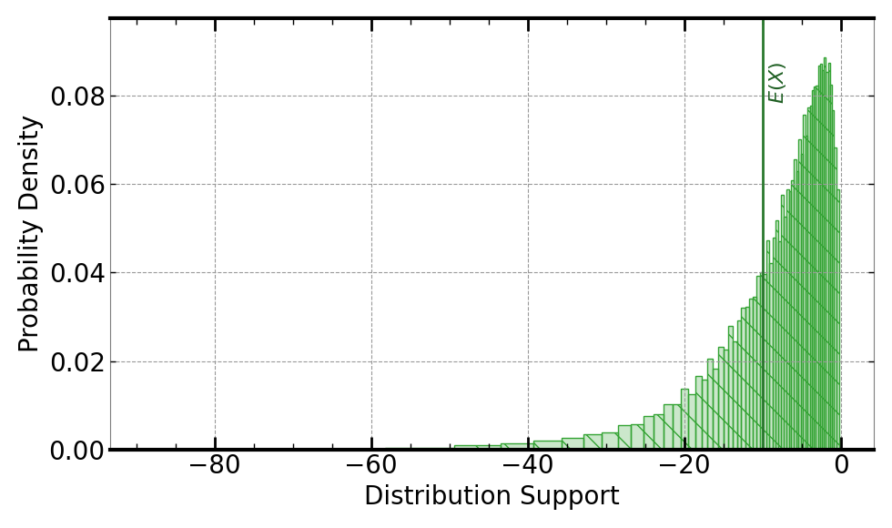

[](https://signaloid.io/repositories?connect=https://github.com/signaloid/Signaloid-Demo-Sensors-SensirionSDP8xxAnalogConversionRoutines#gh-dark-mode-only)
[](https://signaloid.io/repositories?connect=https://github.com/signaloid/Signaloid-Demo-Sensors-SensirionSDP8xxAnalogConversionRoutines#gh-light-mode-only)

# Sensirion SDP8x6-Analog Sensor Calibration Use Case
Example demonstrating real-time output uncertainty estimation for calibrated ADC values from the Sensirion SDP8x6-Analog sensor[^1].

## Introduction
The Sensirion SDP8x6-Analog sensor is a differential pressure sensor with analog output.
This application demo calculates the calibrated pressure outputs for different variants of the sensor in different configurations.

## Getting started

The correct way to clone this repository to get the submodules is:
```sh
	git clone --recursive git@github.com:signaloid/Signaloid-Demo-Sensors-SensirionSDP8xxAnalogConversionRoutines.git
```

If you forgot to clone with `--recursive` and end up with empty submodule directories, you can remedy this with:
```sh
	git submodule update --init
```

## Running the application locally
Apart from using Signaloid's Cloud Compute Platform, you can compile and run this application
locally. Local execution is essentially a native Monte Carlo implementation,
that uses GNU Scientific Library (GSL)[^2] to generate samples for the different input distributions.
In this mode the application stores the generated output samples, in a file called `data.out`.
The first line of `data.out` contains the execution time of the Monte Carlo implementation
in microseconds (μs), and each
next line contains a floating-point value corresponding to an output sample value.
Please note, that for the Monte Carlo output mode, you need to select a single output
to calculate, using (`-S`) command-line option.

In order to compile and run this application in the native Monte Carlo mode:

0. Install dependencies (e.g., on Linux):
```
sudo apt-get install libgsl-dev libgslcblas0
```
1. Compile natively (e.g., on Linux):
```
cd src/
gcc -I. -I/opt/local/include main.c utilities.c common.c uxhw.c -L/opt/local/lib -o native-exe -lgsl -lgslcblas -lm
```
2. Run the application in the MonteCarlo mode, using (`-M`) command-line option:
```
./native-exe -M 10000 -S 0
```
The above program runs 10000 Monte Carlo iterations, calculating the output chosen by (`-S 0`) command-line option.
3. See the output samples generated by the local Monte Carlo execution:
```
cat data.out
```

## Inputs
The inputs to the SDP8x6 sensor conversion algorithms are the analog voltage output of the sensor ($A_{out}$)
as well as the Supply voltage of the sensor ($V_{dd}$). The algorithm models the uncertainty in the analog output as
well as in the supply voltage using uniform distributions.

The uncertainty in $A_{out}$ is modeled as a (`UniformDist(1.3, 1.7)`) Volts.

The uncertainty in $V_{dd}$ is modeled as a (`UniformDist(3.5, 3.9)`) Volts.


## Outputs
The output is the calibrated pressure in Pascal. There are two variants of the sensor (125Pa and 500Pa range) and each can operate
in either a linear mode or with quare root output. See the datasheet[^1] for more information. Select
between the variants using the `-S` command-line parameter:
- `-S 0`: Calculates the calibrated output of 500Pa sensor variant in linear configuration, given by
```math
\mathrm{Calibrated Sensor Output} = \frac{750 * A_{out}}{V_{dd}} - 150
```
Following is an example output, using Signaloid's C0Pro-S core:


- `-S 1`: Calculates the calibrated output o 125Pa sensor variant in linear configuration, given by
```math
\mathrm{Calibrated Sensor Output} = \frac{190 * A_{out}}{V_{dd}} - 38
```
Following is an example output, using Signaloid's C0Pro-S core:


- `-S 2`: Calculates the calibrated output of 500Pa sensor variant in square root configuration, given by
```math
\mathrm{Calibrated Sensor Output} = sign(\frac{A_{out}}{V_{dd}} - 0.5)*{(\frac{A_{out}}{V_{dd} * 0.4} - 1.25)}^2 * 525
``` 
Following is an example output, using Signaloid's C0Pro-S core:


- `-S 3`: Calculates the calibrated output of 125Pa sensor variant in square root configuration, given by
```math
\mathrm{Calibrated Sensor Output} = sign(\frac{A_{out}}{V_{dd}} - 0.5)*{(\frac{A_{out}}{V_{dd} * 0.4} - 1.25)}^2 * 133
```

Following is an example output, using Signaloid's C0Pro-S core:



- `-S 4`: Calculates all previous calibrated outputs. Selected by default.


## Usage
```
Example: SDP8x6 sensor conversion routines - Signaloid version

Usage: Valid command-line arguments are:
	[-o, --output <Path to output CSV file : str>] (Specify the output file.)
	[-S, --select-output <output : int>] (Compute 0-indexed output. Calculate all possible outputs if equal to 4. Default value: 4.)
	[-M, --multiple-executions <Number of executions : int (Default: 1)>] (Repeated execute kernel for benchmarking.)
	[-T, --time] (Timing mode: Times and prints the timing of the kernel execution.)
	[-b, --benchmarking] (Benchmarking mode: Generate outputs in format for benchmarking.)
	[-j, --json] (Print output in JSON format.)
	[-h, --help] (Display this help message.)
```


---

[^1]: [Datasheet SDP8x6-Analog](https://www.mouser.com/datasheet/2/682/Sensirion_Differential_Pressure_Datasheet_SDP8xx_A-3051563.pdf).

[^2]: [GNU Scientific Library](https://www.gnu.org/software/gsl/).

